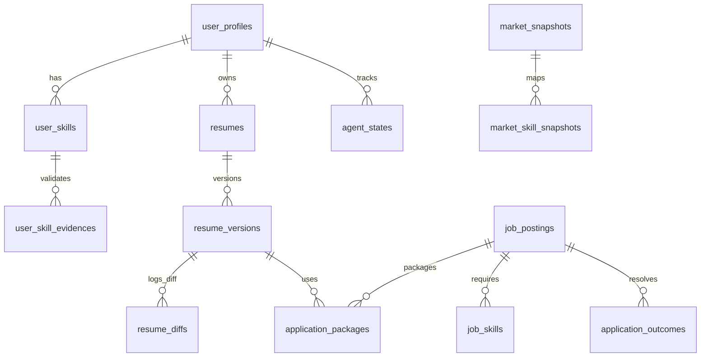

# Deep Architectural Audit Report: SDE Career Intelligence OS (Expose Autospy)

This document provides a comprehensive, class-by-class, and file-by-file audit of the SDE Career Intelligence OS (**Expose Autospy**). It traces structural hierarchies, operational pipelines, database entities, cognitive engines, AI capabilities, and systemic technical debt. This report is designed to serve as a high-fidelity reference for subsequent engineering phases.

---

## 1. Executive Summary

### Project Purpose
The **Expose Autospy** application is a lightweight, template-driven FastAPI web application that serves as a personalized workstation and career acceleration dashboard for Software Development Engineers (SDEs). Its objective is to automate career score calculation, monitor market trends, detect skill gaps, generate customized job application materials (ATS-optimized resume versions and tailored cover letters), prepare candidates for interviews via adaptive quiz modules, and manage a recruitment funnel.

### Current Maturity Level
The repository operates at a **Localized Interactive Simulator / Local MVP** maturity level. 
* **Strengths:** Fully implemented SQLAlchemy domain mapping, Pydantic input contract definitions, and complete business calculations for career analysis (milestones, ROI, constraints, score weightings, projections). The user interface is driven by HTMX to enable dynamic partial page updates without bulky client-side frameworks.
* **Limitations:** The core automated action layers are fully simulated. Real-time web scrapers for job sourcing raise `NotImplementedError`; resume compilation is restricted to plain-text databases; browser automation for auto-submitting job applications is missing; and third-party LLM providers default to deterministic local fallbacks when API keys are not supplied.

### Key Capabilities Implemented
1. **User Profile & Onboarding Wizard:** Configures target roles, timelines, and current versus target compensation bounds ([profile_service.py](file:///d:/DOWNLOAD/Softwares/expose-autospy/app/services/profile_service.py)).
2. **Job Match Engine:** Computes compatibility scores (0-100) using multi-factor weights (Skill: 40%, Experience: 20%, Salary: 20%, Role Title: 20%) ([job_match_agent.py](file:///d:/DOWNLOAD/Softwares/expose-autospy/app/services/job_match_agent.py)).
3. **Cognitive Engines:** Generates strategy roadmaps, simulates career scenarios (Backend vs. Platform vs. AI Engineer), computes skill acquisition ROIs, identifies real-world constraints, and projects 30/60/90-day progress metrics ([app/cognitive/](file:///d:/DOWNLOAD/Softwares/expose-autospy/app/cognitive)).
4. **Adaptive Quiz Prep:** Formulates adaptive question lists by filtering category weaknesses, missing skills, and SDE seniority targets ([quiz_intelligence.py](file:///d:/DOWNLOAD/Softwares/expose-autospy/app/services/quiz_intelligence.py)).
5. **Resume & Cover Letter Customizer:** Automates reordering of profile skills and rephrasing summaries to match Job Descriptions without fabricating credentials ([resume_intelligence.py](file:///d:/DOWNLOAD/Softwares/expose-autospy/app/services/resume_intelligence.py)).
6. **Unified Agent Loop:** Orchestrates observation, planning, recommendation, and memory persistence in a structured run cycle ([orchestrator.py](file:///d:/DOWNLOAD/Softwares/expose-autospy/app/agents/orchestrator.py)).

### Missing Capabilities
1. **Real-Time Job Portal Scrapers:** LinkedIn, Naukri, and ATS platforms are not integrated; they raise errors ([job_source.py](file:///d:/DOWNLOAD/Softwares/expose-autospy/app/services/job_source.py)).
2. **ATS-Ready PDF Compiler:** The system lacks HTML-to-PDF rendering logic (e.g., WeasyPrint or ReportLab integration) to export resumes.
3. **Browser Automation Engine:** Playwright browser automation to parse HTML forms, fill inputs, and execute submissions is unimplemented.
4. **Human-in-the-Loop Interventions:** WebSockets mechanisms to pause browser execution for CAPTCHAs/MFA codes and prompt the user are missing.
5. **Active Background Worker Loop:** Schedulers inspect database timestamps, but there is no background worker (e.g., Celery, APScheduler, or asyncio loop) to continuously pull jobs.

### Estimated Completion Percentage
**45%**. The data architecture, scoring algorithms, interactive widgets, local mock capabilities, and UI frameworks are fully implemented, but the active automation pipelines, web scrapers, browser execution engines, and multi-agent LLM reasoning loops remain unbuilt.

---

## 2. Repository Structure

Below is the directory tree of the source files in the codebase (excluding Python cache folders and the virtual environment `venv` folder):

```
expose-autospy/
├── jobs_import.csv
├── requirements.txt
├── README.md
├── test_app.py
└── app/
    ├── config.py
    ├── main.py
    ├── agents/
    │   ├── __init__.py
    │   ├── execution_agent.py
    │   ├── learning_agent.py
    │   ├── memory_agent.py
    │   ├── observer_agent.py
    │   ├── orchestrator.py
    │   ├── planner_agent.py
    │   └── recommendation_agent.py
    ├── cognitive/
    │   ├── career_brief_generator.py
    │   ├── career_strategy_engine.py
    │   ├── constraint_engine.py
    │   ├── decision_engine.py
    │   ├── forecasting_engine.py
    │   ├── prioritization_engine.py
    │   ├── roi_engine.py
    │   └── scenario_engine.py
    ├── database/
    │   ├── __init__.py
    │   ├── career.db
    │   ├── connection.py
    │   └── seed.py
    ├── models/
    │   ├── __init__.py
    │   ├── contracts.py
    │   └── domain.py
    ├── routes/
    │   ├── __init__.py
    │   ├── dashboard.py
    │   ├── interviews.py
    │   ├── jobs.py
    │   ├── learning.py
    │   └── profile.py
    ├── services/
    │   ├── __init__.py
    │   ├── ai_provider.py
    │   ├── career_coach_agent.py
    │   ├── career_growth_analytics.py
    │   ├── career_score_engine.py
    │   ├── cover_letter_agent.py
    │   ├── daily_mission_engine.py
    │   ├── datasource.py
    │   ├── discovery_scheduler.py
    │   ├── execution_service.py
    │   ├── interview_academy.py
    │   ├── interview_service.py
    │   ├── job_discovery_service.py
    │   ├── job_match_agent.py
    │   ├── job_service.py
    │   ├── job_source.py
    │   ├── learning_service.py
    │   ├── market_trend_engine.py
    │   ├── notification_service.py
    │   ├── opportunity_engine.py
    │   ├── outcome_analyzer.py
    │   ├── profile_service.py
    │   ├── quiz_intelligence.py
    │   ├── readiness_engine.py
    │   ├── readiness_prediction.py
    │   ├── resume_intelligence.py
    │   ├── roadmap_engine.py
    │   └── salary_intelligence.py
    ├── static/
    │   ├── css/
    │   │   └── style.css
    │   └── js/
    │       └── main.js
    ├── templates/
    │   ├── base.html
    │   ├── components/
    │   │   ├── academy_dashboard.html
    │   │   ├── interview_card.html
    │   │   ├── interview_edit_card.html
    │   │   ├── interview_list.html
    │   │   ├── job_card.html
    │   │   ├── job_card_with_oob_stats.html
    │   │   ├── job_edit_card.html
    │   │   ├── job_list.html
    │   │   ├── job_list_with_stats.html
    │   │   ├── learning_card.html
    │   │   ├── learning_list.html
    │   │   ├── learning_list_with_stats.html
    │   │   ├── profile_card.html
    │   │   ├── quiz_result.html
    │   │   ├── quiz_session.html
    │   │   └── sidebar.html
    │   └── pages/
    │       ├── dashboard.html
    │       ├── executive_report.html
    │       ├── interviews.html
    │       ├── jobs.html
    │       ├── learning.html
    │       ├── onboarding.html
    │       └── profile.html
    └── utils/
        ├── __init__.py
        └── helpers.py
```

### Purpose of Packages & Modules

#### Root Configuration and Entry Points
* [requirements.txt](file:///d:/DOWNLOAD/Softwares/expose-autospy/requirements.txt): Lists Python dependencies (e.g., FastAPI, SQLAlchemy, Uvicorn, Pydantic).
* [jobs_import.csv](file:///d:/DOWNLOAD/Softwares/expose-autospy/jobs_import.csv): The static dataset containing mock SDE job listings for local ingestion.
* [test_app.py](file:///d:/DOWNLOAD/Softwares/expose-autospy/test_app.py): Implements comprehensive integration and unit tests for endpoints and calculation models.
* [app/main.py](file:///d:/DOWNLOAD/Softwares/expose-autospy/app/main.py): Initializes the FastAPI server, runs database tables creation, seeds default records, mounts static assets, and registers routes.
* [app/config.py](file:///d:/DOWNLOAD/Softwares/expose-autospy/app/config.py): Stores application settings and feature toggles (`FEATURE_FLAGS`).

#### Agents Package (`app/agents/`)
Implements the multi-agent execution loop based on observation and planning cycles:
* [orchestrator.py](file:///d:/DOWNLOAD/Softwares/expose-autospy/app/agents/orchestrator.py): The main coordinator that runs the step-by-step agent loop and records snapshots to `AgentState`.
* [observer_agent.py](file:///d:/DOWNLOAD/Softwares/expose-autospy/app/agents/observer_agent.py): Scans the active database to calculate readiness metrics, salary baselines, and delta parameters.
* [planner_agent.py](file:///d:/DOWNLOAD/Softwares/expose-autospy/app/agents/planner_agent.py): Formulates weekly topics and daily study checklists.
* [recommendation_agent.py](file:///d:/DOWNLOAD/Softwares/expose-autospy/app/agents/recommendation_agent.py): Generates priority learning options while checking rejection history.
* [learning_agent.py](file:///d:/DOWNLOAD/Softwares/expose-autospy/app/agents/learning_agent.py): Analyzes interview academy practice records and flags topics where average scores are low.
* [memory_agent.py](file:///d:/DOWNLOAD/Softwares/expose-autospy/app/agents/memory_agent.py): Handles database persistence for states, recommendation histories, and sequential tracking data.
* [execution_agent.py](file:///d:/DOWNLOAD/Softwares/expose-autospy/app/agents/execution_agent.py): Assembles action items (resumes, cover letters, and learning steps) into ready application packages.

#### Cognitive Package (`app/cognitive/`)
Contains localized reasoning engines that simulate, forecast, and prioritize career decisions:
* [career_brief_generator.py](file:///d:/DOWNLOAD/Softwares/expose-autospy/app/cognitive/career_brief_generator.py): Compiles forecasts, ROI, constraints, and scenarios into a unified career brief.
* [career_strategy_engine.py](file:///d:/DOWNLOAD/Softwares/expose-autospy/app/cognitive/career_strategy_engine.py): Formulates 6, 12, and 18-month strategic milestones.
* [constraint_engine.py](file:///d:/DOWNLOAD/Softwares/expose-autospy/app/cognitive/constraint_engine.py): Adjusts schedules based on weekly hour limits and SDE seniority levels.
* [decision_engine.py](file:///d:/DOWNLOAD/Softwares/expose-autospy/app/cognitive/decision_engine.py): Identifies risks, opportunities, and quick-win items.
* [forecasting_engine.py](file:///d:/DOWNLOAD/Softwares/expose-autospy/app/cognitive/forecasting_engine.py): Projects 30, 60, and 90-day estimates for compensation, skills count, and interview readiness.
* [prioritization_engine.py](file:///d:/DOWNLOAD/Softwares/expose-autospy/app/cognitive/prioritization_engine.py): Ranks competing tasks (learning, applying, mock practice, resume updates) into a unified queue.
* [roi_engine.py](file:///d:/DOWNLOAD/Softwares/expose-autospy/app/cognitive/roi_engine.py): Evaluates the Return on Investment score for acquiring missing technologies.
* [scenario_engine.py](file:///d:/DOWNLOAD/Softwares/expose-autospy/app/cognitive/scenario_engine.py): Simulates paths (Backend vs. Platform vs. AI Engineer) mapping success likelihoods.

#### Database Package (`app/database/`)
* [connection.py](file:///d:/DOWNLOAD/Softwares/expose-autospy/app/database/connection.py): Sets up the SQLAlchemy database engine, session factory, and transaction session lifecycle.
* [seed.py](file:///d:/DOWNLOAD/Softwares/expose-autospy/app/database/seed.py): Seeds the database with default profiles, interview questions, and company practice patterns.

#### Models Package (`app/models/`)
* [domain.py](file:///d:/DOWNLOAD/Softwares/expose-autospy/app/models/domain.py): Defines SQLAlchemy models and Pydantic schemas for input validation.
* [contracts.py](file:///d:/DOWNLOAD/Softwares/expose-autospy/app/models/contracts.py): Specifies data contracts returned by core services.

#### Routes Package (`app/routes/`)
* [dashboard.py](file:///d:/DOWNLOAD/Softwares/expose-autospy/app/routes/dashboard.py): Serves dashboard rendering, notifications, recommendation accept/rejection, and application package management.
* [profile.py](file:///d:/DOWNLOAD/Softwares/expose-autospy/app/routes/profile.py): Exposes endpoints to edit, save, and update user profiles and skill definitions.
* [jobs.py](file:///d:/DOWNLOAD/Softwares/expose-autospy/app/routes/jobs.py): Handles job additions, editing, deletions, CSV imports, and status adjustments.
* [learning.py](file:///d:/DOWNLOAD/Softwares/expose-autospy/app/routes/learning.py): Renders the dynamic career roadmaps page.
* [interviews.py](file:///d:/DOWNLOAD/Softwares/expose-autospy/app/routes/interviews.py): Powers interview practice card management, academy stats, and adaptive quiz engines.

#### Services Package (`app/services/`)
Houses the core business logic and engine algorithms:
* [ai_provider.py](file:///d:/DOWNLOAD/Softwares/expose-autospy/app/services/ai_provider.py): Establishes abstract interfaces and implements Google Gemini Pro/Flash API integrations.
* [career_coach_agent.py](file:///d:/DOWNLOAD/Softwares/expose-autospy/app/services/career_coach_agent.py): Creates structured study plan checklists based on current skill gaps.
* [career_growth_analytics.py](file:///d:/DOWNLOAD/Softwares/expose-autospy/app/services/career_growth_analytics.py): Aggregates historical metrics to plot progress timelines.
* [career_score_engine.py](file:///d:/DOWNLOAD/Softwares/expose-autospy/app/services/career_score_engine.py): Computes the weighted Career Score and lists actionable improvements.
* [cover_letter_agent.py](file:///d:/DOWNLOAD/Softwares/expose-autospy/app/services/cover_letter_agent.py): Drafts customized cover letters using profile details and company data.
* [daily_mission_engine.py](file:///d:/DOWNLOAD/Softwares/expose-autospy/app/services/daily_mission_engine.py): Unused placeholder module.
* [datasource.py](file:///d:/DOWNLOAD/Softwares/expose-autospy/app/services/datasource.py): Handles local SQL queries and imports job listings from CSV.
* [discovery_scheduler.py](file:///d:/DOWNLOAD/Softwares/expose-autospy/app/services/discovery_scheduler.py): Assesses the age of scraped database records.
* [execution_service.py](file:///d:/DOWNLOAD/Softwares/expose-autospy/app/services/execution_service.py): Generates textual application packages and updates status fields.
* [interview_academy.py](file:///d:/DOWNLOAD/Softwares/expose-autospy/app/services/interview_academy.py): Calculates question completion percentages and aggregates company patterns.
* [interview_service.py](file:///d:/DOWNLOAD/Softwares/expose-autospy/app/services/interview_service.py): Implements standard database CRUD operations for interview prep cards.
* [job_discovery_service.py](file:///d:/DOWNLOAD/Softwares/expose-autospy/app/services/job_discovery_service.py): Dedupes and registers incoming jobs.
* [job_match_agent.py](file:///d:/DOWNLOAD/Softwares/expose-autospy/app/services/job_match_agent.py): Computes job compatibility scores.
* [job_service.py](file:///d:/DOWNLOAD/Softwares/expose-autospy/app/services/job_service.py): Manages CRUD operations for the active job funnel.
* [job_source.py](file:///d:/DOWNLOAD/Softwares/expose-autospy/app/services/job_source.py): Abstract base classes and placeholders for job portal scrapers.
* [learning_service.py](file:///d:/DOWNLOAD/Softwares/expose-autospy/app/services/learning_service.py): Unused helper module.
* [market_trend_engine.py](file:///d:/DOWNLOAD/Softwares/expose-autospy/app/services/market_trend_engine.py): Identifies high-demand, trending, and emerging technologies.
* [notification_service.py](file:///d:/DOWNLOAD/Softwares/expose-autospy/app/services/notification_service.py): Manages internal system notifications.
* [opportunity_engine.py](file:///d:/DOWNLOAD/Softwares/expose-autospy/app/services/opportunity_engine.py): Unused database helper module.
* [outcome_analyzer.py](file:///d:/DOWNLOAD/Softwares/expose-autospy/app/services/outcome_analyzer.py): Analyzes stage counts and checks historical success parameters.
* [profile_service.py](file:///d:/DOWNLOAD/Softwares/expose-autospy/app/services/profile_service.py): Manages profile database operations.
* [quiz_intelligence.py](file:///d:/DOWNLOAD/Softwares/expose-autospy/app/services/quiz_intelligence.py): Adaptive quiz question selector.
* [readiness_engine.py](file:///d:/DOWNLOAD/Softwares/expose-autospy/app/services/readiness_engine.py): Measures target role compatibility based on skill overlap.
* [readiness_prediction.py](file:///d:/DOWNLOAD/Softwares/expose-autospy/app/services/readiness_prediction.py): Projects readiness growth metrics.
* [resume_intelligence.py](file:///d:/DOWNLOAD/Softwares/expose-autospy/app/services/resume_intelligence.py): Customizes summaries, reorders skills, and reviews bullet points.
* [roadmap_engine.py](file:///d:/DOWNLOAD/Softwares/expose-autospy/app/services/roadmap_engine.py): Builds structured, skill-focused study roadmaps.
* [salary_intelligence.py](file:///d:/DOWNLOAD/Softwares/expose-autospy/app/services/salary_intelligence.py): Establishes market salary baselines and missing skill premiums.

#### Templates, Statics, Helpers
* [app/utils/helpers.py](file:///d:/DOWNLOAD/Softwares/expose-autospy/app/utils/helpers.py): Implements HTML formatting shortcuts and Jinja2 rendering utilities.
* `app/static/`: Houses CSS designs and front-end interactivity controllers.
* `app/templates/`: Jinja2 HTML layout components.

---

## 3. Architecture Analysis

### High-Level Architecture Diagram
The following diagram illustrates the relationship between the client interface, FastAPI routers, core agents, cognitive engines, data services, and database layers:

```
                  +----------------------------------------------+
                  |               Web Browser Client             |
                  |     (onboarding, dashboard, prep views)     |
                  +--------------------+-------------------------+
                                       | HTTP requests (HTML/HTMX)
                                       v
                  +--------------------+-------------------------+
                  |         FastAPI Route Handlers (app/routes/)  |
                  | (dashboard.py, profile.py, jobs.py, etc.)    |
                  +---------+--------------------------+---------+
                            |                          |
                            | Invokes                  | Invokes
                            v                          v
+---------------------------+----+            +--------+------------------+
|      FastAPI Services          |            |     Agent orchestrator    |
|       (app/services/)          |            |   (app/agents/orchestrator.py)|
| (ai_provider.py,               |            +--------+---------+--------+
|  career_score_engine.py,       |                     |         |
|  resume_intelligence.py, etc.) |                     | Calls   | Logs
|                                |                     v         v
+-------------------+------------+            +--------+---+   +-+--------+
                    |                         | Sub-agents |   | Database |
                    | Queries                 | (observer, |   | (SQLite) |
                    v                         | planner,   |   | connection|
+-------------------+------------+            | memory,    |   | .py)     |
|       Cognitive Engines        |            | learning)  |   +----------+
|        (app/cognitive/)        |            +------------+
| (roi_engine.py, scenario_engine.py,         |
|  forecasting_engine.py, etc.)  |<-----------+ (Provides state snapshots)
+--------------------------------+
```

### Data Flow
1. **Ingestion Flow:** Job records are ingested via CSV parsing ([datasource.py](file:///d:/DOWNLOAD/Softwares/expose-autospy/app/services/datasource.py)) or manually. When ingested, raw details are normalized, deduped, and saved in `job_postings` and `job_skills`.
2. **Analysis Flow:** The profile service fetches the user's SDE profile. The market trends engine calculates the frequency of demanded skills. The readiness and salary engines evaluate compatibility scores, salary gaps, and missing skill premiums.
3. **Application Preparation Flow:** The user approves a job posting in the review queue. The system reorders skills, rephrases summaries, and generates tailored cover letters and resume variants, storing them in `application_packages`.
4. **Execution and Feedback Flow:** The user submits the application package, updating the status to "Submitted" and adding it to the `job_applications` table. If the user records recruitment outcomes (offers/rejections), these details are logged to train scoring weights.
5. **Practice and Learning Flow:** The adaptive quiz engine retrieves questions matching missing skills and the user's seniority level. Completed answers are evaluated, stored in `interview_questions`, and analyzed to flag low retention areas.

### Request Flow
1. The user interacts with the page (e.g., clicks "Approve" on an opportunity queue card).
2. The browser dispatches an AJAX POST request via HTMX (`hx-post="/jobs/queue/{posting_id}/approve"`).
3. The routing controller `jobs.py` delegates execution to `profile_service.get_profile`, `resume_intelligence.create_resume_variant`, `cover_letter_agent.generate_cover_letter_v2`, and `job_match_agent.calculate_job_match`.
4. The service layer executes business logic, modifies SQLite database records, and returns updated structures.
5. The routing controller renders a partial HTML snippet (e.g., an empty response `Response(content="")` or a status label) and sends it back to the client.
6. The client browser updates the DOM dynamically without reloading the entire page.

### Agent Flow
The unified agent execution cycle runs as follows:

```
[observe_career_state] 
        │
        ▼ (Generates ObservationSnapshot: scores, salary, missing skills)
[plan_career_actions]
        │
        ▼ (Generates WeeklyPlan & DailyPlan: study topics, task checklists)
[generate_recommendations]
        │
        ▼ (Generates CareerRecommendations; filters previously rejected topics)
[analyze_learning_progress]
        │
        ▼ (Generates LearningAdjustments; flags weak categories under 7.0/10)
[log_agent_state] 
        │
        ▼ (Persists goals, roadmaps, and scores into the database)
  Dashboard Updates
```

---

## 4. Database Analysis

### Database Type
**SQLite** file-based database, configured via [connection.py](file:///d:/DOWNLOAD/Softwares/expose-autospy/app/database/connection.py) (file path: `app/database/career.db`).

### Schema & Tables

#### 1. `user_profiles`
Stores user profile metrics and onboarding state.
* `id`: INTEGER (Primary Key, Indexed)
* `full_name`: VARCHAR (Not Null)
* `current_role`: VARCHAR (Not Null)
* `experience_years`: INTEGER (Not Null)
* `current_salary`: FLOAT (Not Null)
* `target_role`: VARCHAR (Not Null)
* `target_salary`: FLOAT (Not Null)
* `target_timeline`: VARCHAR (Not Null)
* `is_onboarded`: BOOLEAN (Not Null)

#### 2. `user_skills`
Stores user-declared technical skills.
* `id`: INTEGER (Primary Key, Indexed)
* `user_profile_id`: INTEGER (Foreign Key referencing `user_profiles.id`, Not Null)
* `skill_name`: VARCHAR (Not Null)
* `level`: VARCHAR (Not Null) (Beginner, Intermediate, Advanced)

#### 3. `user_skill_evidences`
Stores evidence proofs validating user skill proficiency.
* `id`: INTEGER (Primary Key, Indexed)
* `user_skill_id`: INTEGER (Foreign Key referencing `user_skills.id`, Not Null)
* `evidence_type`: VARCHAR (Not Null) (Project, Interview, Certification, Work Experience)
* `title`: VARCHAR (Not Null)
* `notes`: TEXT (Null, Default empty string)

#### 4. `job_postings`
Stores ingested job listing records.
* `id`: INTEGER (Primary Key, Indexed)
* `title`: VARCHAR (Not Null)
* `company`: VARCHAR (Not Null)
* `location`: VARCHAR (Not Null)
* `source`: VARCHAR (Not Null)
* `salary`: FLOAT (Null, Default 0.0)
* `description`: TEXT (Null, Default empty string)
* `posted_date`: DATE (Not Null)
* `created_at`: DATETIME (Default UTC now)
* `review_status`: VARCHAR (Not Null, Default "pending") (pending, approved, rejected, saved)

#### 5. `job_skills`
Maps required technical skills to job postings.
* `id`: INTEGER (Primary Key, Indexed)
* `job_posting_id`: INTEGER (Foreign Key referencing `job_postings.id`, Not Null)
* `skill_name`: VARCHAR (Not Null)

#### 6. `job_applications`
Tracks applications in the manual recruitment funnel.
* `id`: INTEGER (Primary Key, Indexed)
* `company`: VARCHAR (Not Null)
* `position`: VARCHAR (Not Null)
* `status`: VARCHAR (Not Null) (Wishlist, Applied, Interview, Offer, Rejected)
* `applied_date`: DATE (Not Null)
* `notes`: TEXT (Null, Default empty string)

#### 7. `interview_questions`
Tracks completed practice questions, scores, and feedback.
* `id`: INTEGER (Primary Key, Indexed)
* `company`: VARCHAR (Not Null)
* `question`: TEXT (Not Null)
* `category`: VARCHAR (Not Null)
* `difficulty`: VARCHAR (Not Null) (Easy, Medium, Hard)
* `personal_answer`: TEXT (Null, Default empty string)
* `score`: INTEGER (Null, Default 0) (0 to 10 scale)
* `feedback`: TEXT (Null, Default empty string)

#### 8. `import_runs`
Audit log of CSV imports.
* `id`: INTEGER (Primary Key, Indexed)
* `filename`: VARCHAR (Not Null)
* `imported_records`: INTEGER (Not Null)
* `failed_records`: INTEGER (Not Null)
* `started_at`: DATETIME (Not Null)
* `completed_at`: DATETIME (Not Null)
* `status`: VARCHAR (Not Null) (Success, Failed, Partial)
* `error_message`: TEXT (Null)

#### 9. `market_snapshots`
Logs chronological entries of market scans.
* `id`: INTEGER (Primary Key, Indexed)
* `created_at`: DATETIME (Default UTC now)

#### 10. `market_skill_snapshots`
Logs skill frequency scores associated with market snapshots.
* `id`: INTEGER (Primary Key, Indexed)
* `snapshot_id`: INTEGER (Foreign Key referencing `market_snapshots.id`, Not Null)
* `skill_name`: VARCHAR (Not Null)
* `frequency`: INTEGER (Not Null)
* `demand_score`: FLOAT (Not Null)

#### 11. `company_insights`
Stores corporate profiles.
* `id`: INTEGER (Primary Key, Indexed)
* `company_name`: VARCHAR (Unique, Not Null)
* `industry`: VARCHAR (Null)
* `rating`: FLOAT (Null)
* `interview_difficulty`: VARCHAR (Null, Default "Medium")
* `hiring_status`: VARCHAR (Null, Default "Hiring")
* `notes`: TEXT (Null)

#### 12. `discovery_runs`
Logs job discovery runs.
* `id`: INTEGER (Primary Key, Indexed)
* `source`: VARCHAR (Not Null)
* `started_at`: DATETIME (Not Null)
* `completed_at`: DATETIME (Null)
* `status`: VARCHAR (Not Null) (Success, Failed, Running)
* `records_found`: INTEGER (Not Null)
* `records_imported`: INTEGER (Not Null)
* `error_message`: TEXT (Null)

#### 13. `resumes`
Tracks user resumes.
* `id`: INTEGER (Primary Key, Indexed)
* `user_profile_id`: INTEGER (Foreign Key referencing `user_profiles.id`, Not Null)
* `title`: VARCHAR (Not Null)
* `created_at`: DATETIME (Default UTC now)
* `updated_at`: DATETIME (Default UTC now)

#### 14. `resume_versions`
Stores versioned resume content.
* `id`: INTEGER (Primary Key, Indexed)
* `resume_id`: INTEGER (Foreign Key referencing `resumes.id`, Not Null)
* `version_number`: INTEGER (Not Null)
* `summary`: TEXT (Not Null)
* `skills`: TEXT (Not Null) (Comma-separated string)
* `experience`: TEXT (Not Null) (JSON serialized array of experience objects)
* `match_score`: FLOAT (Null)
* `target_job_id`: INTEGER (Foreign Key referencing `job_postings.id`, Null)
* `created_at`: DATETIME (Default UTC now)

#### 15. `resume_diffs`
Logs modifications between resume versions.
* `id`: INTEGER (Primary Key, Indexed)
* `resume_version_id`: INTEGER (Foreign Key referencing `resume_versions.id`, Not Null)
* `parent_version_id`: INTEGER (Foreign Key referencing `resume_versions.id`, Null)
* `diff_text`: TEXT (Not Null)
* `created_at`: DATETIME (Default UTC now)

#### 16. `application_outcomes`
Tracks job application outcomes for score calibration.
* `id`: INTEGER (Primary Key, Indexed)
* `job_posting_id`: INTEGER (Foreign Key referencing `job_postings.id`, Not Null)
* `opportunity_score`: FLOAT (Not Null)
* `result`: VARCHAR (Not Null) (Applied, Rejected, Interview, Offer, Withdrawn)
* `notes`: TEXT (Null)

#### 17. `company_question_patterns`
Logs historical category frequencies per company.
* `id`: INTEGER (Primary Key, Indexed)
* `company`: VARCHAR (Not Null)
* `category`: VARCHAR (Not Null)
* `frequency`: INTEGER (Not Null)
* `difficulty`: VARCHAR (Not Null)

#### 18. `question_bank`
Predefined pool of interview questions.
* `id`: INTEGER (Primary Key, Indexed)
* `question`: TEXT (Not Null)
* `category`: VARCHAR (Not Null)
* `difficulty`: VARCHAR (Not Null) (Beginner, Intermediate, Advanced, Senior, Staff)
* `tags`: VARCHAR (Null) (Comma-separated tags)

#### 19. `notifications`
Stores system notifications.
* `id`: INTEGER (Primary Key, Indexed)
* `type`: VARCHAR (Not Null) (job_imported, roadmap_updated, etc.)
* `message`: TEXT (Not Null)
* `created_at`: DATETIME (Default UTC now)
* `read`: BOOLEAN (Not Null, Default False)

#### 20. `agent_states`
Stores dynamic snapshots of the agent loop.
* `id`: INTEGER (Primary Key, Indexed)
* `user_profile_id`: INTEGER (Foreign Key referencing `user_profiles.id`, Not Null)
* `current_goal`: VARCHAR (Not Null)
* `current_roadmap`: TEXT (Not Null) (JSON serialized roadmap data)
* `current_readiness`: FLOAT (Not Null)
* `current_salary_estimate`: FLOAT (Not Null)
* `current_recommendations`: TEXT (Not Null) (JSON serialized recommendation list)
* `last_observation`: TEXT (Not Null) (JSON serialized observation state)
* `last_plan`: TEXT (Not Null) (JSON serialized planning data)
* `last_outcome`: TEXT (Not Null) (JSON serialized execution data)

#### 21. `recommendation_histories`
Stores learning recommendation outcomes.
* `id`: INTEGER (Primary Key, Indexed)
* `recommendation`: TEXT (Not Null)
* `created_at`: DATETIME (Default UTC now)
* `accepted`: BOOLEAN (Not Null)
* `rejected`: BOOLEAN (Not Null)
* `outcome`: VARCHAR (Not Null)
* `result`: VARCHAR (Null)
* `readiness_gain`: FLOAT (Null)
* `salary_gain`: FLOAT (Null)
* `interview_gain`: FLOAT (Null)

#### 22. `application_packages`
Aggregates materials for a job application.
* `id`: INTEGER (Primary Key, Indexed)
* `job_posting_id`: INTEGER (Foreign Key referencing `job_postings.id`, Not Null)
* `match_score`: FLOAT (Not Null)
* `resume_version_id`: INTEGER (Foreign Key referencing `resume_versions.id`, Null)
* `cover_letter`: TEXT (Null)
* `missing_skills`: TEXT (Null) (JSON serialized list)
* `salary_analysis`: TEXT (Null)
* `status`: VARCHAR (Not Null, Default "Draft") (Draft, Approved, Submitted)
* `created_at`: DATETIME (Default UTC now)
* `updated_at`: DATETIME (Default UTC now)

### Relationships



### Indexes
Indexes are configured only on primary key columns:
* SQLite creates automatic index structures on `PRIMARY KEY` and `UNIQUE` constraints (e.g., `user_profiles.id`, `user_skills.id`, `company_insights.company_name`, etc.).

### Missing Indexes (Recommended)
Add indexes on foreign key columns queried in joins or filter conditions:
* `user_skills(user_profile_id)`
* `user_skill_evidences(user_skill_id)`
* `job_skills(job_posting_id)`
* `resumes(user_profile_id)`
* `resume_versions(resume_id)`
* `application_packages(job_posting_id)`
* `application_packages(resume_version_id)`
* `agent_states(user_profile_id)`

### Data Consistency Concerns
1. **JSON Serialization in Columns:** Tables `agent_states` and `resume_versions` store complex objects as JSON-serialized strings. SQLite does not validate schemas for serialized text, making parsing errors possible if data formats change.
2. **SQLite Foreign Keys Enforcement:** While relationships are mapped in SQLAlchemy, SQLite does not enforce foreign keys by default. The connection pool setup in `connection.py` does not configure the required sqlite connection PRAGMA:
   ```python
   # Recommended fix for SQLite foreign keys:
   from sqlalchemy.engine import Engine
   from sqlalchemy import event
   @event.listens_for(Engine, "connect")
   def set_sqlite_pragma(dbapi_connection, connection_record):
       cursor = dbapi_connection.cursor()
       cursor.execute("PRAGMA foreign_keys=ON")
       cursor.close()
   ```
3. **Company Data Integrity:** `CompanyQuestionPattern` has no foreign key constraint mapping it to the `company_insights` table, which can lead to orphaned company lists.
4. **Enum Columns:** Status fields (`review_status`, `result`, `status`) are mapped as plain string columns, which bypasses database-level check constraints.

---

## 5. Agent Analysis

### 1. Orchestration Agent (`Orchestrator`)
* **Responsibility:** Manages the career state optimization execution loop: Observe $\rightarrow$ Plan $\rightarrow$ Recommend $\rightarrow$ Persist.
* **Inputs:** Database session `Session`, target SDE `UserProfile` record.
* **Outputs:** `OrchestrationResult` data structure.
* **Dependencies:** `observer_agent`, `planner_agent`, `recommendation_agent`, `learning_agent`, `memory_agent`.
* **Current Status:** Implemented as a deterministic loop runner in [orchestrator.py](file:///d:/DOWNLOAD/Softwares/expose-autospy/app/agents/orchestrator.py).
* **Missing Functionality:** Lacks support for asynchronous sub-tasks, parallel agent execution, and self-correcting logic paths.

### 2. Observer Agent (`observer_agent`)
* **Responsibility:** Computes current readiness metrics, salary gaps, and missing skill lists.
* **Inputs:** Database session `Session`, user `UserProfile`.
* **Outputs:** `ObservationSnapshot` values.
* **Dependencies:** `calculate_readiness` ([readiness_engine.py](file:///d:/DOWNLOAD/Softwares/expose-autospy/app/services/readiness_engine.py)), `analyze_salaries` ([salary_intelligence.py](file:///d:/DOWNLOAD/Softwares/expose-autospy/app/services/salary_intelligence.py)).
* **Current Status:** Fully operational local calculations.
* **Missing Functionality:** Does not track changes in external market distributions; estimates are calculated only against the local database state.

### 3. Planner Agent (`planner_agent`)
* **Responsibility:** Creates weekly study areas and daily study/review checklists based on detected skill gaps.
* **Inputs:** `ObservationSnapshot`.
* **Outputs:** Tuple containing `WeeklyPlan` and `DailyPlan`.
* **Dependencies:** None.
* **Current Status:** Uses local list slicing to select up to 3 missing skills and generate study plans.
* **Missing Functionality:** Lacks the ability to parse external syllabus content, match online course recommendations, or adjust timelines dynamically based on study feedback.

### 4. Recommendation Agent (`recommendation_agent`)
* **Responsibility:** Generates priority study plans, filtering out topics previously rejected in `RecommendationHistory`.
* **Inputs:** Database session `Session`, `WeeklyPlan`.
* **Outputs:** List of `CareerRecommendation` objects.
* **Dependencies:** `RecommendationHistory` model queries.
* **Current Status:** Successfully filters out previously rejected keywords.
* **Missing Functionality:** Cannot dynamically query web learning paths or evaluate alternative skill substitutions.

### 5. Learning Agent (`learning_agent`)
* **Responsibility:** Audits solved practice scores and flags categories where average scores fall below 7.0/10.
* **Inputs:** Database session `Session`.
* **Outputs:** List of `LearningAdjustment` details.
* **Dependencies:** `InterviewQuestion` data queries.
* **Current Status:** Compiles list-level recommendations if average scores fall below target thresholds.
* **Missing Functionality:** Lacks the ability to select remedial practice sets or adjust quiz difficulty levels automatically.

### 6. Memory Agent (`memory_agent`)
* **Responsibility:** Persists snapshots of user metrics, logs recommendations, and tracks progress histories.
* **Inputs:** Database session `Session`, metric values.
* **Outputs:** Saved database model references.
* **Dependencies:** `AgentState` and `RecommendationHistory` tables.
* **Current Status:** Handles database writes for snapshotting.
* **Missing Functionality:** Lacks support for vector memory indexing or semantic queries to retrieve historical decisions.

### 7. Execution Agent (`execution_agent`)
* **Responsibility:** Generates resume variants, customized cover letters, and learning roadmaps.
* **Inputs:** Database session `Session`, `UserProfile`, `JobPosting`, or skill names.
* **Outputs:** `PreparedAction` configurations.
* **Dependencies:** `resume_intelligence`, `cover_letter_agent`.
* **Current Status:** Assembles textual descriptions and drafts cover letters.
* **Missing Functionality:** Lacks PDF generation engines and browser submit capabilities.

---

## 6. Feature Inventory

### 1. Profile Onboarding Wizard
* **Description:** Configures target roles, timelines, and compensation bounds, and initializes user skills.
* **Status:** Fully Implemented.
* **Entry Point:** HTTP GET `/onboarding` $\rightarrow$ POST `/onboarding/submit`.
* **APIs:** `/onboarding/submit`.
* **Services Used:** `profile_service`.
* **Database Usage:** Modifies `UserProfile` and replaces matching `UserSkill` entries.

### 2. Job Tracker Funnel
* **Description:** A Kanban-style system to monitor positions across Wishlist, Applied, Interview, Offer, and Rejected stages.
* **Status:** Fully Implemented.
* **Entry Point:** HTTP GET `/jobs` $\rightarrow$ POST `/jobs` $\rightarrow$ DELETE `/jobs/{id}`.
* **APIs:** `/jobs`, `/jobs/{id}/edit`, `/jobs/{id}/cancel`, `/jobs/{id}`.
* **Services Used:** `job_service`.
* **Database Usage:** Read/Write operations on the `job_applications` table.

### 3. Sourcing Queue & Application Package Builder
* **Description:** Reviews scraped job postings, tailors resume structures and cover letters, and logs outcomes.
* **Status:** Core logic is implemented, but external scraping and PDF rendering are simulated.
* **Entry Points:** Dashboard queue buttons $\rightarrow$ HTTP POST `/dashboard/discover`, POST `/jobs/queue/{id}/approve`, POST `/jobs/queue/{id}/reject`, POST `/jobs/queue/{id}/save`.
* **APIs:** `/dashboard/discover`, `/dashboard/import-csv`, `/jobs/queue/{posting_id}/approve`, `/jobs/queue/{posting_id}/reject`, `/jobs/queue/{posting_id}/save`.
* **Services Used:** `job_discovery_service`, `resume_intelligence`, `cover_letter_agent`, `job_match_agent`.
* **Database Usage:** Read/Write operations on `job_postings`, `job_skills`, `resumes`, `resume_versions`, `resume_diffs`, and `application_packages`.

### 4. Interactive Interview Academy & Adaptive Quizzes
* **Description:** Selects and evaluates practice questions based on profile gaps, category weaknesses, and seniority targets.
* **Status:** Fully Implemented.
* **Entry Points:** Prepare Tab views $\rightarrow$ HTTP GET `/interviews`, GET `/interviews/quiz/generate`, POST `/interviews/quiz/submit`.
* **APIs:** `/interviews`, `/interviews/{id}/edit`, `/interviews/{id}/cancel`, `/interviews/academy/data`, `/interviews/quiz/generate`, `/interviews/quiz/submit`.
* **Services Used:** `interview_service`, `interview_academy`, `quiz_intelligence`.
* **Database Usage:** Read/Write operations on `QuestionBank` and `interview_questions`.

### 5. Weekly Executive Report
* **Description:** Compiles forecasting metrics, skill ROI analyses, time constraints, and strategic roadmaps.
* **Status:** Fully Implemented.
* **Entry Point:** HTTP GET `/dashboard/executive-report`.
* **APIs:** `/dashboard/executive-report`.
* **Services Used:** `career_brief_generator`, `prioritization_engine`, `memory_agent`.
* **Database Usage:** Reads `UserProfile`, `AgentState`, and `JobApplication` records.

### 6. Internal Notification Engine
* **Description:** Logs and displays system notifications for user events (e.g., job imports, roadmap updates, task completions).
* **Status:** Fully Implemented.
* **Entry Point:** HTTP POST `/dashboard/notifications/read`, POST `/dashboard/notifications/{id}/read`.
* **APIs:** `/dashboard/notifications/read`, `/dashboard/notifications/{notification_id}/read`.
* **Services Used:** `notification_service`.
* **Database Usage:** Read/Write operations on `notifications`.

---

## 7. API Analysis

Here is a detailed trace of the FastAPI endpoint routing registry, detailing request inputs, response types, and internal code paths:

### 1. Get Workstation Dashboard
* **URL:** `/`
* **Method:** `GET`
* **Request Schema:** None (Uses request parameters)
* **Response Schema:** HTML (page template `pages/dashboard.html` or redirection if onboarding is incomplete)
* **Internal Flow:** Checks profile onboarding status $\rightarrow$ Calls `market_trend_engine.analyze_market_trends` $\rightarrow$ Calculates gap list $\rightarrow$ Generates roadmap, salary intelligence, and readiness metrics $\rightarrow$ Calls `orchestrator.run_orchestration_loop` $\rightarrow$ Retrieves resumes, recent import runs, application outcome stats, and packages $\rightarrow$ Renders Dashboard HTML.

### 2. Get Onboarding Form
* **URL:** `/onboarding`
* **Method:** `GET`
* **Request Schema:** None
* **Response Schema:** HTML (page template `pages/onboarding.html`)
* **Internal Flow:** Renders the multi-step onboarding wizard.

### 3. Submit Onboarding Data
* **URL:** `/onboarding/submit`
* **Method:** `POST`
* **Request Schema:** `Form(...)` (attributes: `full_name`, `current_role`, `experience_years`, `current_salary`, `target_role`, `target_salary`, `target_timeline`, skill checkboxes)
* **Response Schema:** RedirectResponse (`/`)
* **Internal Flow:** Saves profile details $\rightarrow$ Deletes existing user skills $\rightarrow$ Parses and saves new `UserSkill` entries $\rightarrow$ Logs system notification $\rightarrow$ Redirects to dashboard.

### 4. Mark All Notifications as Read
* **URL:** `/dashboard/notifications/read`
* **Method:** `POST`
* **Request Schema:** None
* **Response Schema:** Plain text (`"All notifications marked read."`)
* **Internal Flow:** Updates `read` attribute to `True` for all matching rows in `notifications`.

### 5. Mark Single Notification as Read
* **URL:** `/dashboard/notifications/{notification_id}/read`
* **Method:** `POST`
* **Request Schema:** Path variable `notification_id: int`
* **Response Schema:** Empty Response
* **Internal Flow:** Updates the `read` attribute to `True` for the target notification.

### 6. Approve Recommendation
* **URL:** `/dashboard/agents/approve`
* **Method:** `POST`
* **Request Schema:** Form input `topic: str`
* **Response Schema:** HTML (success block snippet for HTMX swapping)
* **Internal Flow:** Logs the topic to `RecommendationHistory` with `accepted=True` $\rightarrow$ Triggers notification $\rightarrow$ Returns HTMX success block.

### 7. Reject Recommendation
* **URL:** `/dashboard/agents/reject`
* **Method:** `POST`
* **Request Schema:** Form input `topic: str`
* **Response Schema:** HTML (rejection block snippet)
* **Internal Flow:** Logs the topic to `RecommendationHistory` with `rejected=True` $\rightarrow$ Triggers notification $\rightarrow$ Returns HTMX rejection block.

### 8. Get Executive Report
* **URL:** `/dashboard/executive-report`
* **Method:** `GET`
* **Request Schema:** None
* **Response Schema:** HTML (page template `pages/executive_report.html`)
* **Internal Flow:** Calls `generate_weekly_career_brief` and `prioritize_opportunities` $\rightarrow$ Queries historical readiness and salary trends $\rightarrow$ Renders Executive Report HTML.

### 9. Approve Application Package
* **URL:** `/dashboard/packages/{package_id}/approve`
* **Method:** `POST`
* **Request Schema:** Path variable `package_id: int`
* **Response Schema:** HTML status label
* **Internal Flow:** Sets package status to `"Approved"` $\rightarrow$ Triggers notification $\rightarrow$ Returns HTML label.

### 10. Submit Application Package
* **URL:** `/dashboard/packages/{package_id}/submit`
* **Method:** `POST`
* **Request Schema:** Path variable `package_id: int`
* **Response Schema:** Empty response (removes card via HTMX)
* **Internal Flow:** Calls `execution_service.save_submission_record` (updates package status, logs applied status in funnel, records outcome entry) $\rightarrow$ Triggers notification $\rightarrow$ Returns empty response.

### 11. Export Application Package Text
* **URL:** `/dashboard/packages/{package_id}/export`
* **Method:** `GET`
* **Request Schema:** Path variable `package_id: int`
* **Response Schema:** Plain text download (`package_{id}.txt`)
* **Internal Flow:** Calls `execution_service.export_package` $\rightarrow$ Assembles plain-text format cover letter and resume $\rightarrow$ Dispatches text download response.

### 12. List Active Funnel Jobs
* **URL:** `/jobs`
* **Method:** `GET`
* **Request Schema:** Optional query filters (`search`, `status`)
* **Response Schema:** HTML (Template `components/job_list.html` if HTMX request, else full page `pages/jobs.html`)
* **Internal Flow:** Queries matching rows from `job_applications` using search/status parameters $\rightarrow$ Returns list template or full page.

### 13. Create Funnel Job
* **URL:** `/jobs`
* **Method:** `POST`
* **Request Schema:** `Form(...)` (attributes: `company`, `position`, `status`, `applied_date`, `notes`)
* **Response Schema:** HTML (Template `components/job_list_with_stats.html`)
* **Internal Flow:** Parses form inputs $\rightarrow$ Calls `job_service.create_job` $\rightarrow$ Queries fresh job lists and counts $\rightarrow$ Sets header `"HX-Trigger": "jobAdded"` $\rightarrow$ Returns template update.

### 14. Get Funnel Job Edit View
* **URL:** `/jobs/{job_id}/edit`
* **Method:** `GET`
* **Request Schema:** Path variable `job_id: int`
* **Response Schema:** HTML (Template `components/job_edit_card.html`)
* **Internal Flow:** Fetches job record $\rightarrow$ Returns edit row template.

### 15. Cancel Edit View
* **URL:** `/jobs/{job_id}/cancel`
* **Method:** `GET`
* **Request Schema:** Path variable `job_id: int`
* **Response Schema:** HTML (Template `components/job_card.html`)
* **Internal Flow:** Fetches job record $\rightarrow$ Returns standard card template.

### 16. Update Funnel Job
* **URL:** `/jobs/{job_id}/edit`
* **Method:** `POST`
* **Request Schema:** Path variable `job_id: int`, `Form(...)` variables (same as create)
* **Response Schema:** HTML (Template `components/job_card_with_oob_stats.html`)
* **Internal Flow:** Validates parameters $\rightarrow$ Calls `job_service.update_job` $\rightarrow$ Calculates fresh stats $\rightarrow$ Returns card markup containing stats replacements.

### 17. Delete Funnel Job
* **URL:** `/jobs/{job_id}`
* **Method:** `DELETE`
* **Request Schema:** Path variable `job_id: int`
* **Response Schema:** HTML (Out-Of-Band stats elements)
* **Internal Flow:** Calls `job_service.delete_job` $\rightarrow$ Calculates fresh stats $\rightarrow$ Returns HTML snippets to update the sidebar counters.

### 18. Trigger Job Discovery Scraper
* **URL:** `/dashboard/discover`
* **Method:** `POST`
* **Request Schema:** None
* **Response Schema:** RedirectResponse (`/`)
* **Internal Flow:** Calls `job_discovery_service.run_job_discovery(db, source_type="CSV")` $\rightarrow$ Logs notifications $\rightarrow$ Redirects to dashboard.

### 19. Import CSV Endpoint (Fallback)
* **URL:** `/dashboard/import-csv`
* **Method:** `POST`
* **Request Schema:** None
* **Response Schema:** Empty Response with header `"HX-Redirect": "/"`
* **Internal Flow:** Performs CSV discovery run $\rightarrow$ Dispatches client redirect header.

### 20. Approve Discovered Job Posting
* **URL:** `/jobs/queue/{posting_id}/approve`
* **Method:** `POST`
* **Request Schema:** Path variable `posting_id: int`
* **Response Schema:** Empty Response
* **Internal Flow:** Sets posting status to `"approved"` $\rightarrow$ Fetches user profile $\rightarrow$ Generates optimized resume version $\rightarrow$ Drafts cover letter $\rightarrow$ Calculates match and salary impact metrics $\rightarrow$ Creates `ApplicationPackage` draft $\rightarrow$ Dispatches notifications $\rightarrow$ Returns empty response.

### 21. Reject Discovered Job Posting
* **URL:** `/jobs/queue/{posting_id}/reject`
* **Method:** `POST`
* **Request Schema:** Path variable `posting_id: int`
* **Response Schema:** Empty Response
* **Internal Flow:** Updates `review_status` to `"rejected"` in the database $\rightarrow$ Returns empty response.

### 22. Save Discovered Job Posting
* **URL:** `/jobs/queue/{posting_id}/save`
* **Method:** `POST`
* **Request Schema:** Path variable `posting_id: int`
* **Response Schema:** Empty Response
* **Internal Flow:** Updates `review_status` to `"saved"` in the database $\rightarrow$ Returns empty response.

### 23. Log Recruitment Outcome
* **URL:** `/jobs/applications/outcome`
* **Method:** `POST`
* **Request Schema:** Form inputs (`job_posting_id`, `result`, `notes`)
* **Response Schema:** Plain text (`"Outcome saved successfully."`)
* **Internal Flow:** Verifies job posting $\rightarrow$ Checks for existing outcome records $\rightarrow$ Saves `ApplicationOutcome` entry containing match scores $\rightarrow$ Dispatches notification.

### 24. Get Roadmaps Page
* **URL:** `/learning`
* **Method:** `GET`
* **Request Schema:** None
* **Response Schema:** HTML (page template `pages/learning.html`)
* **Internal Flow:** Retrieves user profile $\rightarrow$ Extracts missing skills from market trends $\rightarrow$ Calls `roadmap_engine.generate_roadmap` $\rightarrow$ Renders roadmaps template.

### 25. Get Prep Questions Library
* **URL:** `/interviews`
* **Method:** `GET`
* **Request Schema:** Optional queries (`search`, `difficulty`)
* **Response Schema:** HTML (Template `components/interview_list.html` if HTMX request, else full page `pages/interviews.html`)
* **Internal Flow:** Queries matching records from `interview_questions` using search and difficulty filters $\rightarrow$ Renders questions template.

### 26. Add Practice Prep Card
* **URL:** `/interviews`
* **Method:** `POST`
* **Request Schema:** `Form(...)` (attributes: `company`, `question`, `category`, `difficulty`, `personal_answer`, `score`, `feedback`)
* **Response Schema:** HTML (Template `components/interview_list.html`)
* **Internal Flow:** Inserts new row to `interview_questions` $\rightarrow$ Returns refreshed card listing.

### 27. Get Practice Card Edit View
* **URL:** `/interviews/{question_id}/edit`
* **Method:** `GET`
* **Request Schema:** Path variable `question_id: int`
* **Response Schema:** HTML (Template `components/interview_edit_card.html`)
* **Internal Flow:** Fetches question card $\rightarrow$ Returns edit view component.

### 28. Cancel Practice Card Edit
* **URL:** `/interviews/{question_id}/cancel`
* **Method:** `GET`
* **Request Schema:** Path variable `question_id: int`
* **Response Schema:** HTML (Template `components/interview_card.html`)
* **Internal Flow:** Fetches question card $\rightarrow$ Returns read-only card template.

### 29. Update Practice Card
* **URL:** `/interviews/{question_id}/edit`
* **Method:** `POST`
* **Request Schema:** Path variable `question_id: int`, `Form(...)` variables (same as create)
* **Response Schema:** HTML (Template `components/interview_card.html`)
* **Internal Flow:** Updates `interview_questions` $\rightarrow$ Returns standard card layout.

### 30. Delete Practice Card
* **URL:** `/interviews/{question_id}`
* **Method:** `DELETE`
* **Request Schema:** Path variable `question_id: int`
* **Response Schema:** Empty Response
* **Internal Flow:** Deletes row from `interview_questions` $\rightarrow$ Returns empty response.

### 31. Get Academy Completion Metrics
* **URL:** `/interviews/academy/data`
* **Method:** `GET`
* **Request Schema:** None
* **Response Schema:** HTML (Template `components/academy_dashboard.html`)
* **Internal Flow:** Calculates category completion percentages $\rightarrow$ Aggregates company patterns from `CompanyQuestionPattern` $\rightarrow$ Returns academy dashboard HTML.

### 32. Generate Adaptive Quiz
* **URL:** `/interviews/quiz/generate`
* **Method:** `GET`
* **Request Schema:** Optional query parameter `quiz_type` (daily, weekly, monthly)
* **Response Schema:** HTML (Template `components/quiz_session.html`)
* **Internal Flow:** Checks user profile and experience level $\rightarrow$ Resolves weak categories $\rightarrow$ Retrieves uncompleted candidate questions from `QuestionBank` matching preferred categories and target difficulty $\rightarrow$ Renders quiz session panel.

### 33. Submit Quiz Answer
* **URL:** `/interviews/quiz/submit`
* **Method:** `POST`
* **Request Schema:** Form inputs (`question_id`, `personal_answer`)
* **Response Schema:** HTML (Template `components/quiz_result.html`)
* **Internal Flow:** Fetches target question bank row $\rightarrow$ Evaluates answer length and keyword matching $\rightarrow$ Computes score and feedback $\rightarrow$ Creates new practice card in `interview_questions` $\rightarrow$ Returns evaluation feedback HTML.

---

## 8. Automation Analysis

### Schedulers
The system contains no background scheduling engine (such as Celery, APScheduler, or system cron integrations). 
* **Data Freshness Tracker:** [discovery_scheduler.py](file:///d:/DOWNLOAD/Softwares/expose-autospy/app/services/discovery_scheduler.py) queries the database for the last successful `DiscoveryRun` and displays a status indicator ("Fresh" or "Stale") on the UI. The user must click a manual dashboard button to run job ingestion.

### Background Jobs
There are no asynchronous background workers or thread pools configured for execution tasks. Operations (including CSV discovery and AI resume tailoring) run synchronously within the FastAPI request-response thread pool.

### Workflows
The application follows a structured stage progression model:

```
[CSV Ingestion / Manual Add] ──► JobReviewQueue (review_status = "pending")
                                         │
                                         ├──► Reject (review_status = "rejected")
                                         ├──► Save (review_status = "saved")
                                         └──► Approve (review_status = "approved")
                                                 │
                                                 ▼
                                      Spawns optimized resume version
                                      Generates tailored cover letter
                                      Saves ApplicationPackage (status = "Draft")
                                                 │
                                                 ▼ (User clicks Approve)
                                      ApplicationPackage (status = "Approved")
                                                 │
                                                 ▼ (User clicks Submit)
                                      ApplicationPackage (status = "Submitted")
                                      Creates JobApplication (status = "Applied")
                                      Creates ApplicationOutcome (result = "Applied")
```

### Triggers
1. **Client UI Event Triggers:** Initiated via HTMX headers:
   * `"HX-Trigger": "jobAdded"`: Instructs the frontend client to close the add-job modal.
   * `"HX-Trigger": "interviewAdded"`: Instructs the client to reset forms and refresh list views.
2. **Database Change Triggers:** There are no native SQL database-level triggers. All state changes are managed within the application code.

### Event Handling
State modifications (such as importing data or approving applications) write notifications to the database:
```python
notification_service.create_notification(
    db=db,
    n_type="system",
    message="System Event Message"
)
```
These notifications are queried synchronously on page reloads to show indicators in the user dashboard.

---

## 9. Knowledge & Memory Analysis

### Memory Architecture
The memory architecture is split into episodic snapshots and structural tables:
* **Episodic memory:** `AgentState` captures snapshots of user profiles, goals, roadmap phases, readiness scores, estimated compensation values, and decisions. This allows the system to compute readiness change deltas relative to previous states.
* **Rejection memory:** `RecommendationHistory` tracks accepted and rejected topics. If the user rejects a recommended skill, the recommendation agent filters it out in subsequent planning loops:
  ```python
  rejected_records = db.query(RecommendationHistory).filter(RecommendationHistory.rejected == True).all()
  rejected_keywords = [r.recommendation.lower() for r in rejected_records]
  # ...
  if any(topic.lower() in kw for kw in rejected_keywords):
      continue  # Skip recommendation
  ```

### Knowledge Storage
* **Core Skill Knowledge:** Extracted dynamically from SDE job descriptions and mapped to `job_skills` associated with the `JobPosting` model.
* **Preparation Library:** Stored in `QuestionBank` (containing questions, category associations, difficulty ranges, and tag lists) and `CompanyQuestionPattern` (capturing company-specific interview category trends).

### Context Management
Active profile values, target roles, and skill lists serve as the input context for calculations (such as compatibility assessments, weekly planner recommendations, and adaptive quiz selections). The system manages context locally using standard SQL queries and SQLAlchemy models.

### Learning Mechanisms
The learning agent analyzes the user's practice scores. If a category's average score falls below 7.0/10, the system generates a `LearningAdjustment` advising immediate review:
```python
low_retention_categories = db.query(
    InterviewQuestion.category,
    func.avg(InterviewQuestion.score).label("avg_score")
).filter(InterviewQuestion.score > 0)\
 .group_by(InterviewQuestion.category)\
 .having(func.avg(InterviewQuestion.score) < 7.0).all()
```
This adjustment updates the dashboard alerts on the next loop cycle.

---

## 10. AI Capability Analysis

### Models Used
The system is configured to use Google's **`gemini-1.5-flash`** model.

### Prompting Architecture
The application implements raw prompt engineering using Python's standard `urllib.request` library. It bypasses external LLM wrappers (such as LangChain) and calls the API endpoints directly. 

Prompts enforce strict JSON output responses using system rules:
```
Return ONLY a JSON object with keys:
- 'critique': list of suggestions/critiques
- 'bullet_suggestions': list of dicts with keys 'original' and 'suggested'
- 'overall_score': integer from 0 to 100
```
Response cleanup logic is implemented in `ai_provider.py` to remove markdown delimiters (e.g., ` ```json ` blocks).

### Tool Calling Architecture
The application does not use tool-calling or function-calling APIs. It uses direct prompt engineering and parses raw JSON responses to extract data.

### Reasoning Flow
1. **Request Formulation:** Prepares context strings (e.g., resume texts, job descriptions).
2. **API Dispatch:** Sends a POST request to Google's API endpoint with a 12-second timeout.
3. **Parsing Block:** Cleans the markdown response and parses it using `json.loads`.
4. **Fallback Handling:** If the API call fails or the API key is not configured, the system falls back to deterministic local rule engines (e.g., regex checks, keyword search, standard text generators).

### Limitations
1. **No Robust Error Recovery:** If Gemini returns invalid JSON, parsing throws an error, prompting the system to fall back to local rule logic.
2. **Strict Context Limits:** The system passes raw resumes and job descriptions as plain text, making it vulnerable to context limits or performance degradation if input files are very large.
3. **Synchronous Requests:** API calls execute synchronously inside route threads, which can cause requests to hang if responses are slow.

---

## 11. Technical Debt Analysis

### Code Smells
* **Heuristic Fallbacks:** When the Gemini API is unavailable, the system fallback logic uses primitive hardcoded replacements (e.g., replacing `"responsible for"` with `"Architected and delivered"`).
* **Hardcoded Timeframes:** The roadmap engine assumes a fixed study duration of `"3 Weeks"` for all missing technologies and `"4 Weeks"` for system design. It does not account for user skill levels or complexity differences.
* **Inline Imports:** Modules import dependencies inside functions (e.g., importing `ApplicationPackage` and analytics modules inside dashboard endpoints) to prevent circular dependency errors.

### Duplicate Logic
* **CSV Processing Duplicate:** Both `job_discovery_service.py` and `datasource.py` contain duplicate CSV parsing logic for `jobs_import.csv`, using slightly different field checks.
* **Cover Letter Drafting:** Both `cover_letter_agent.py` and `execution_agent.py` contain logic for generating cover letters, leading to redundant implementations.

### Dead Code
* **Placeholder Providers:** `ClaudeProvider` and `OpenAIProvider` are empty classes that are never instantiated or used.
* **Unused Service Modules:** Modules [daily_mission_engine.py](file:///d:/DOWNLOAD/Softwares/expose-autospy/app/services/daily_mission_engine.py), [learning_service.py](file:///d:/DOWNLOAD/Softwares/expose-autospy/app/services/learning_service.py), and [opportunity_engine.py](file:///d:/DOWNLOAD/Softwares/expose-autospy/app/services/opportunity_engine.py) are empty or not imported anywhere in the core application.

### Tight Coupling
* **Direct Database Dependencies:** Services and cognitive engines import SQLAlchemy session factories and query models directly. This violates the dependency inversion principle and makes it difficult to implement separate mock layers for testing.
* **Mixed Router Logic:** Router endpoints handle business calculation logic directly instead of delegating to service classes.

### Scalability Concerns
* **Synchronous Database Threading:** The application executes SQLite operations synchronously. If many users access the dashboard at the same time, this could cause thread pool starvation and delay responses.
* **No Pagination:** Job application tracking and interview practice cards are loaded into memory as complete lists, which could cause performance bottlenecks if the database grows large.

### Security Concerns
* **No Authentication:** There is no authentication or authorization layer. The database seeds a single user profile, and all requests access and modify this single profile.
* **Vulnerability to SQL Injection:** The system uses SQLite and maps queries via SQLAlchemy, but raw text filters are used in search endpoints, which could expose security vulnerabilities if input sanitization is bypassed.

---

## 12. Missing Components

To evolve this local simulator into a fully autonomous, production-ready system, the following components are required:

### 1. Autonomous Career Assistant
* **Skill Acquisition Validator:** A service that checks portfolio platforms (such as GitHub, LeetCode, or certification registries) to automatically verify when the user has acquired a missing skill.
* **Adaptive Career Path Modeler:** An engine that monitors market demand shifts and automatically adjusts target skills and timelines.

### 2. Autonomous Job Hunting Agent
* **Playwright Browser Automation Worker:** A headless worker service that automates navigating to job portals, completing multi-step applications, and uploading files.
* **LLM Form Parser & Mapper:** A parser that analyzes HTML forms dynamically and maps input fields to profile variables (e.g., mapping `work_history` to corresponding input fields).
* **Anti-Bot Bypass Layer:** Integrated bypass components (such as proxies, request throttling, and captcha-solving service APIs) to prevent scraper blocking.

### 3. Autonomous Learning Agent
* **External Syllabus Crawler:** A scraper that crawls online resources (such as YouTube, technical blogs, or course catalogs) to compile study materials matching target skills.
* **Adaptive Question Generator:** An LLM-powered service that dynamically generates custom practice questions matching target skills and seniority requirements.

### 4. Autonomous Personal Assistant
* **WebSockets Notification Server:** A server that pushes real-time notifications to the client dashboard.
* **Headed Browser Interactivity Panel:** A headed browser iframe or UI modal that allows the user to solve CAPTCHAs, enter MFA codes, or review custom text responses during automated runs.

---

## 13. Readiness Assessment

The following table summarizes the readiness percentages for each architectural layer, representing the current maturity of the system:

| Layer | Readiness % | Engineering Justification |
| :--- | :---: | :--- |
| **Foundation** | **80%** | Web routes, UI designs, and database connections are stable and fully tested. |
| **Memory** | **75%** | Database tables are structured to track history and decisions, but lack vector search capabilities. |
| **Agents** | **50%** | The orchestration loop is implemented, but sub-agents rely on simplified deterministic fallbacks. |
| **Automation** | **10%** | The system assesses data age, but lacks active background workers and scheduling triggers. |
| **Job Hunting** | **25%** | Compatibility scoring works, but browser automation and external scrapers are missing. |
| **Learning** | **60%** | Quiz generation and roadmaps work locally, but lack dynamic syllabus crawler integrations. |
| **Decision Engine** | **65%** | Mathematical models for ROI, scenario paths, and timeline projections are complete. |
| **Personal Assistant** | **5%** | System notifications are generated, but lack communication channels (e.g., Slack, Email, WhatsApp). |
| **Overall Project** | **45%** | **Localized simulator MVP**. High-quality core, but missing automated execution components. |

---

## 14. Recommended Roadmap

```
Phase 1: Real-Time Sourcing  ──►  Phase 2: PDF Compilation  ──►  Phase 3: Playwright Auto-Apply  ──►  Phase 4: Human-in-the-Loop
```

### Phase 1: Real-Time Sourcing (Discovery Agent)
* **Goal:** Implement live job sourcing from LinkedIn and Naukri.
* **Approach:** Build a lightweight Chrome extension that parses job listings from the DOM when the user browses, sending them to the FastAPI backend `/api/jobs/discover` endpoint. This leverages the user's active session to bypass bot detection.
* **Effort:** 3 Weeks
* **Dependencies:** Database schema (`job_postings`, `job_skills`).
* **Risks:** Frequent changes to job portal HTML structures can break DOM selectors.

### Phase 2: PDF Compilation Engine
* **Goal:** Convert tailored plain-text resumes into ATS-friendly PDF documents.
* **Approach:** Implement a rendering service (`pdf_compiler.py`) using **WeasyPrint** to render HTML resume templates into standard PDFs.
* **Effort:** 2 Weeks
* **Dependencies:** `resume_intelligence` version management.
* **Risks:** Font configuration and margins must align with ATS reader requirements.

### Phase 3: Playwright Auto-Apply Agent
* **Goal:** Automate job application submissions.
* **Approach:** Develop a headless worker using `playwright-python` to log in, complete application forms, upload PDF resumes, and submit applications.
* **Effort:** 4 Weeks
* **Dependencies:** Phase 2 (PDF resume generator).
* **Risks:** Dynamic, multi-step application forms require robust input parsing.

### Phase 4: Human-in-the-Loop Fallbacks
* **Goal:** Manage CAPTCHAs, MFA codes, and custom questions during runs.
* **Approach:** Establish WebSockets connections between the backend and the dashboard. If the automated worker gets stuck, it pauses execution and sends a notification to the user to intervene in a headed browser window.
* **Effort:** 3 Weeks
* **Dependencies:** Phase 3 (Playwright automation).
* **Risks:** Network delays or session timeouts if the user takes too long to respond.

---

## 15. Class Inventory

Below is the complete inventory of custom classes defined in the codebase, detailing their location, responsibility, and dependencies:

| Class Name | Package / Module Path | Responsibility | Used By | Dependencies |
| :--- | :--- | :--- | :--- | :--- |
| **UserProfile** | `app.models.domain` | Maps user profiles (experience, target salary) to the database. | `profile_service`, `dashboard.py`, `decision_engine` | `Base` |
| **UserSkill** | `app.models.domain` | Maps user skills to the database. | `profile_service`, `onboarding.submit` | `Base` |
| **UserSkillEvidence** | `app.models.domain` | Maps project and work proofs to the database. | `readiness_engine`, `forecasting_engine` | `Base` |
| **JobPosting** | `app.models.domain` | Maps job listings to the database. | `job_service`, `job_match_agent`, `roadmap_engine` | `Base` |
| **JobSkill** | `app.models.domain` | Maps required skills to job postings. | `job_match_agent`, `readiness_engine`, `market_trend_engine` | `Base` |
| **JobApplication** | `app.models.domain` | Tracks applications in the manual funnel. | `job_service`, `dashboard.py` | `Base` |
| **InterviewQuestion** | `app.models.domain` | Tracks completed practice questions and scores. | `interview_service`, `learning_agent`, `growth_analytics` | `Base` |
| **ImportRun** | `app.models.domain` | Logs audit data for CSV imports. | `datasource.py`, `job_discovery_service` | `Base` |
| **MarketSnapshot** | `app.models.domain` | Logs historical entries of market scans. | `market_trend_engine` | `Base` |
| **MarketSkillSnapshot** | `app.models.domain` | Maps skill frequency scores to market snapshots. | `market_trend_engine` | `Base` |
| **CompanyInsight** | `app.models.domain` | Maps company profiles (rating, status) to the database. | `cover_letter_agent` | `Base` |
| **DiscoveryRun** | `app.models.domain` | Maps job discovery runs to the database. | `job_discovery_service`, `discovery_scheduler` | `Base` |
| **Resume** | `app.models.domain` | Maps general resume details to the database. | `resume_intelligence`, `dashboard` | `Base` |
| **ResumeVersion** | `app.models.domain` | Maps versioned resume content to the database. | `resume_intelligence`, `execution_service` | `Base` |
| **ResumeDiff** | `app.models.domain` | Maps modifications between resume versions. | `resume_intelligence` | `Base` |
| **ApplicationOutcome** | `app.models.domain` | Maps recruitment outcomes to the database. | `outcome_analyzer`, `execution_service` | `Base` |
| **CompanyQuestionPattern**| `app.models.domain` | Maps category frequencies per company. | `interview_academy`, `seed.py` | `Base` |
| **QuestionBank** | `app.models.domain` | Maps practice questions to the database. | `quiz_intelligence`, `seed.py` | `Base` |
| **Notification** | `app.models.domain` | Maps system notifications to the database. | `notification_service`, `dashboard.py` | `Base` |
| **AgentState** | `app.models.domain` | Maps dynamic snapshots of the agent loop to the database. | `memory_agent`, `observer_agent` | `Base` |
| **RecommendationHistory** | `app.models.domain` | Maps accepted/rejected recommendations to the database. | `memory_agent`, `recommendation_agent` | `Base` |
| **ApplicationPackage** | `app.models.domain` | Maps application materials to the database. | `execution_service`, `dashboard` | `Base` |
| **ProfileOnboard** | `app.models.domain` | Validates onboarding data inputs. | `profile.py` | `BaseModel` |
| **UserProfileUpdate** | `app.models.domain` | Validates profile updates. | `profile.py` | `BaseModel` |
| **SkillCreate** | `app.models.domain` | Validates skill definitions. | `profile.py` | `BaseModel` |
| **EvidenceCreate** | `app.models.domain` | Validates skill evidence. | `profile.py` | `BaseModel` |
| **InterviewCreate** | `app.models.domain` | Validates new interview question inputs. | `interviews.py` | `BaseModel` |
| **InterviewUpdate** | `app.models.domain` | Validates interview question updates. | `interviews.py` | `BaseModel` |
| **JobCreate** | `app.models.domain` | Validates new job application inputs. | `jobs.py`, `execution_service` | `BaseModel` |
| **JobUpdate** | `app.models.domain` | Validates job application updates. | `jobs.py` | `BaseModel` |
| **RoadmapPhase** | `app.models.contracts` | Standardizes phase data structures. | `roadmap_engine` | `BaseModel` |
| **RoadmapResult** | `app.models.contracts` | Standardizes roadmap results. | `roadmap_engine` | `BaseModel` |
| **SalaryImpactDetail** | `app.models.contracts` | Standardizes skill impact details. | `salary_intelligence` | `BaseModel` |
| **SalaryAnalysisResult** | `app.models.contracts` | Standardizes salary analysis results. | `salary_intelligence` | `BaseModel` |
| **ReadinessResult** | `app.models.contracts` | Standardizes readiness results. | `readiness_engine` | `BaseModel` |
| **DailyMissionTask** | `app.models.contracts` | Standardizes mission task data. | `daily_mission_engine` | `BaseModel` |
| **DailyMissionResult** | `app.models.contracts` | Standardizes mission results. | `daily_mission_engine` | `BaseModel` |
| **OpportunityResult** | `app.models.contracts` | Standardizes prioritized job listings. | `opportunity_engine` | `BaseModel` |
| **CareerScoreResult** | `app.models.contracts` | Standardizes career scoring results. | `career_score_engine` | `BaseModel` |
| **SuccessPredictor** | `app.services.outcome_analyzer` | Standardizes application success metrics. | `outcome_analyzer` | None |
| **DataSource** | `app.services.datasource` | Abstract class for data ingestion. | `datasource.py` | `ABC` |
| **ManualDataSource** | `app.services.datasource` | Fetches listings stored in SQL. | `datasource.py` | `DataSource` |
| **CSVDataSource** | `app.services.datasource` | Ingests job listings from CSV files. | `datasource.py` | `DataSource` |
| **JobSource** | `app.services.job_source` | Abstract base class for scrapers. | `job_source.py` | `ABC` |
| **CSVSource** | `app.services.job_source` | Parses job listings from CSV files. | `job_source.py` | `JobSource` |
| **ManualImportSource** | `app.services.job_source` | Normalizes manual job listings. | `job_source.py` | `JobSource` |
| **PortalSource** | `app.services.job_source` | Scraper placeholder. | `job_source.py` | `JobSource` |
| **CareerPageSource** | `app.services.job_source` | Scraper placeholder. | `job_source.py` | `JobSource` |
| **APIJobSource** | `app.services.job_source` | API integration placeholder. | `job_source.py` | `JobSource` |
| **AIProvider** | `app.services.ai_provider` | Abstract base class for LLM providers. | `ai_provider.py` | None |
| **GeminiProvider** | `app.services.ai_provider` | Calls Google Gemini API. | `ai_provider.py` | `AIProvider` |
| **ClaudeProvider** | `app.services.ai_provider` | Anthropic integration placeholder. | `ai_provider.py` | `AIProvider` |
| **OpenAIProvider** | `app.services.ai_provider` | OpenAI integration placeholder. | `ai_provider.py` | `AIProvider` |
| **AIProviderFactory** | `app.services.ai_provider` | Resolves LLM provider. | `resume_intelligence`, `cover_letter_agent` | None |
| **OrchestrationResult** | `app.agents.orchestrator` | Standardizes orchestrator results. | `orchestrator.py` | None |
| **ObservationSnapshot** | `app.agents.observer_agent` | Stores state snapshots. | `observer_agent.py`, `planner_agent` | None |
| **WeeklyPlan** | `app.agents.planner_agent` | Stores weekly plans. | `planner_agent.py`, `recommendation_agent` | None |
| **DailyPlan** | `app.agents.planner_agent` | Stores daily plans. | `planner_agent.py` | None |
| **CareerRecommendation** | `app.agents.recommendation_agent` | Stores priority study topics. | `recommendation_agent.py` | None |
| **LearningAdjustment** | `app.agents.learning_agent` | Stores category score alert entries. | `learning_agent.py`, `orchestrator.py` | None |
| **PreparedAction** | `app.agents.execution_agent` | Stores assembled assets (resumes, letters). | `execution_agent.py` | None |
| **CareerEvent** | `app.agents.memory_agent` | Stores chronological event logs. | `memory_agent.py` | None |

---

## 16. Dependency Graph

### Service $\rightarrow$ Service Dependencies
* `job_discovery_service` $\rightarrow$ `job_source`
* `resume_intelligence` $\rightarrow$ `ai_provider`
* `cover_letter_agent` $\rightarrow$ `ai_provider`
* `career_brief_generator` $\rightarrow$ `forecasting_engine`, `roi_engine`, `constraint_engine`, `scenario_engine`, `career_strategy_engine`, `decision_engine`
* `prioritization_engine` $\rightarrow$ `readiness_engine`, `job_match_agent`, `roi_engine`, `constraint_engine`
* `decision_engine` $\rightarrow$ `readiness_engine`, `forecasting_engine`, `roi_engine`, `constraint_engine`, `scenario_engine`
* `forecasting_engine` $\rightarrow$ `readiness_engine`, `salary_intelligence`
* `prioritization_engine` $\rightarrow$ `readiness_engine`, `job_match_agent`, `roi_engine`, `constraint_engine`

### Service $\rightarrow$ Database Dependencies
* `profile_service` $\rightarrow$ reads/writes `user_profiles` and `user_skills`
* `job_service` $\rightarrow$ reads/writes `job_applications`
* `job_discovery_service` $\rightarrow$ writes `job_postings`, `job_skills`, `DiscoveryRun`, `ImportRun`
* `resume_intelligence` $\rightarrow$ writes `resumes`, `resume_versions`, `resume_diffs`
* `interview_service` $\rightarrow$ reads/writes `interview_questions`
* `interview_academy` $\rightarrow$ reads `interview_questions`, `company_question_patterns`
* `quiz_intelligence` $\rightarrow$ reads `QuestionBank`, `interview_questions`
* `notification_service` $\rightarrow$ writes `notifications`
* `outcome_analyzer` $\rightarrow$ reads `JobApplication`, `ApplicationOutcome`
* `execution_service` $\rightarrow$ writes `ApplicationPackage`, `job_applications`, `ApplicationOutcome`

### Agent $\rightarrow$ Agent Dependencies
* `Orchestrator` calls $\rightarrow$ `observer_agent`
* `Orchestrator` calls $\rightarrow$ `planner_agent`
* `Orchestrator` calls $\rightarrow$ `recommendation_agent`
* `Orchestrator` calls $\rightarrow$ `learning_agent`
* `Orchestrator` calls $\rightarrow$ `memory_agent`

### Agent $\rightarrow$ Tools/Services Dependencies
* `observer_agent` $\rightarrow$ `readiness_engine`, `salary_intelligence`, `AgentState` queries
* `recommendation_agent` $\rightarrow$ `RecommendationHistory` queries
* `learning_agent` $\rightarrow$ `InterviewQuestion` average queries
* `memory_agent` $\rightarrow$ `AgentState` database writers

---

## 17. Final Verdict

### What is Already Built
1. **Database Schema:** Full mapping for profile, skills, jobs, applications, questions, notifications, resume version history, and agent state logs.
2. **Dashboard Web Workspace:** Dynamic frontend client using HTML/CSS/HTMX that displays career metrics, application lists, and quiz panels.
3. **Core Calculation Logic:** Complete implementation of compatibility matching, readiness metrics, salary gaps, and progress projections.
4. **Adaptive Quiz System:** Complete logic to select practice questions based on skill gaps, category weaknesses, and seniority requirements.

### What is Partially Built
1. **AI Providers Interface:** Built-in provider class for Google Gemini, but lacks Claude/OpenAI implementations. The system relies on local rule fallbacks if no API keys are configured.
2. **Data Sourcing Services:** Support for CSV imports, but real-time portal scrapers are represented by templates raising errors.
3. **Resume Customizer:** Logic to customize summaries and reorder skill lists, but lacks a PDF compilation engine to export files.

### What Should Be Built Next (Fastest Path to Production)
1. **Implement WeasyPrint Resume PDF Compiler:** Build a service in `app/services/pdf_compiler.py` to compile tailored resume templates into standard PDFs.
2. **Develop a Sourcing Chrome Extension:** Write a lightweight browser extension that parses job details from LinkedIn and Naukri, posting them to the backend API. This leverages the user's active session to bypass scraper blocking.
3. **Build the Playwright Submit Agent:** Develop a background script that automates navigating to job portals, uploading PDFs, and submitting application forms.

### What Should Be Removed
1. **Unused Provider Stubs:** Remove empty classes `ClaudeProvider` and `OpenAIProvider` to simplify provider registration logic.
2. **Unused Service Files:** Delete unused placeholder modules [daily_mission_engine.py](file:///d:/DOWNLOAD/Softwares/expose-autospy/app/services/daily_mission_engine.py), [learning_service.py](file:///d:/DOWNLOAD/Softwares/expose-autospy/app/services/learning_service.py), and [opportunity_engine.py](file:///d:/DOWNLOAD/Softwares/expose-autospy/app/services/opportunity_engine.py) to clean up the repository.
3. **Duplicate CSV Parsing Code:** Refactor `CSVSource` in `job_source.py` and `CSVDataSource` in `datasource.py` into a single helper module.

---
*Report Compiled By: Principal Software Architect, Staff Engineer & Codebase Auditor*
